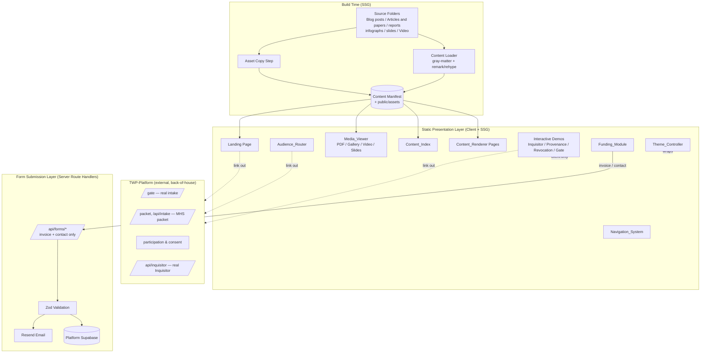

# Design Document

> **Amendment — 2026-07-01: audiences collapsed six → three.** The
> `Audience` union is now `contributor | researcher | funder`
> (`content/types.ts`). `contributor` absorbs Potential_Witness +
> Invited_Professional; `researcher` absorbs Researcher + Philosopher +
> Legal_Expert; `funder` is Investor. The former persona names remain accepted
> as front-matter aliases in the Content Loader, so tagged content still
> resolves. Read the "six audiences" references below through this mapping; the
> `Audience_Router` design is otherwise unchanged (one static page per audience,
> tag-based surfacing, real actions link out to the Platform).

## Overview

The Witness Protocol Portal is a statically generated Next.js website that consolidates the Foundation's existing assets — markdown blog posts, articles, papers, reports, PDFs, PNG infographics, PPTX slide decks, and MP4 videos — into a single, austere, publicly accessible information hub. It serves six audiences (Potential_Witness, Invited_Professional, Researcher, Philosopher, Legal_Expert, Investor), routes each to relevant content and calls to action, and carries forward four interactive demonstrations prototyped in the draft files (`draft_witness_protocol_site.tsx`, `draft2_witness_protocol_site.tsx`): the Inquisitor transcript comparator, the cryptographic provenance explorer, the consent revocation simulator, and the Gate self-assessment simulator.

### Front-of-House / Back-of-House Boundary

The Portal is strictly **front-of-house**: a public, informational surface. It is paired with an external **Platform** — the existing, live `TWP-platform` control plane (Next.js + Supabase + Drizzle, Phase 5 Alpha) — which is **back-of-house** and owns every real action. The Platform already implements the real Gate intake, the reviewer/MHS packet and passwordless intake, participation and consent records, authentication, the audit log, and the real Inquisitor dialogue engine.

The Portal does **not** reimplement any of those. It has no authentication, no testimony intake, no consent records, and no audit log of its own (Req 1). Whenever a Visitor wants to take a real action, the Portal **links out** to the corresponding Platform surface. The new value the Portal adds — the content library, media galleries, audience journeys, funding information, and four explicitly-simulated demonstrations — does not exist on the Platform today.

The design honors the "gravity over gamification" mandate from the project PRD: a near-black "basalt" palette with an off-white "paper" alternate, EB Garamond body type, Cinzel headings, JetBrains Mono for technical labels, no accent hues, no rounded corners, and slow fade-only transitions.

The system splits cleanly into three planes:

1. **Build-time content pipeline** — reads the existing source folders, parses markdown, derives metadata, copies binary assets into the served `public/` tree, and emits a content manifest consumed by statically generated pages.
2. **Static presentation layer** — Next.js pages and React components that render content, media, audience journeys, and the interactive demonstrations entirely client-side or at build time, with no runtime data dependency.
3. **Form submission layer** — a small set of server route handlers serving only the Portal's **two owned forms** (funder/invoice and general contact). They validate input, persist to the Platform's Supabase, and trigger Resend notification emails. This is the only part of the system that performs runtime I/O. All other "actions" (testimony intake, MHS packet, participation, consent, real Inquisitor) are outbound links to the Platform, not Portal-implemented.

### Platform Handoff

The following are **not** built in the Portal; each is an outbound link to an existing Platform surface:

| Visitor intent | Portal behavior | Platform target |
|---|---|---|
| Submit real testimony (Gate intake) | Link out from the Gate simulator and participation CTAs | Platform `/gate` |
| Request the reviewer / MHS packet | Link out from participation and expert journeys | Platform `/packet`, `/api/intake` |
| Participate / provide consent | Link out from the `/participate` page and audience CTAs | Platform participation & consent surface |
| Engage the real Inquisitor dialogue | Link out from the Inquisitor comparator | Platform `/api/inquisitor` |

The four interactive demos remain in the Portal as explicitly-simulated client components. Each visibly links to its real Platform counterpart where one exists: the Gate simulator links to the Platform `/gate` intake, and the Inquisitor comparator references the real Inquisitor at `/api/inquisitor`.

### Key Design Decisions

| Decision | Choice | Rationale |
|---|---|---|
| Scope & boundary | Front-of-house only; link out to the Platform for all real actions | No duplicate auth, testimony intake, consent records, or audit log; the live control plane is never forked or contradicted (Req 1). Real Gate (`/gate`), MHS packet (`/packet`, `/api/intake`), participation/consent, and real Inquisitor (`/api/inquisitor`) are link-out handoffs. |
| Framework | Next.js (App Router) + Tailwind CSS | Static generation for SEO and sub-2s loads (Req 20); React reuse of the draft components; confirmed in requirements. |
| Content source of truth | Existing workspace folders (`Blog posts`, `Articles and papers`, `reports`, `infographs`, `slides`, `Video`) | Maintainers edit source files, not duplicated copies (Req 21). |
| Markdown rendering | `gray-matter` (front-matter) + `remark`/`rehype` via `next-mdx-remote` or `react-markdown` | Mature, well-maintained, preserves headings/lists/quotes/links (Req 5.2). No bespoke parser. |
| Binary assets (PDF/PPTX/MP4/PNG) | Copied into `public/assets/...` by a build step; referenced by manifest | Next.js only serves static files from `public/`; source folders sit at workspace root. |
| Interactive demos | Client components with hardcoded mock data, each linking to its real Platform counterpart | Requirements explicitly state these are simulated demonstrations (Req 11–14); the real actions live on the Platform (Req 1). No backend, no real crypto. |
| Cash funding | Static bank/wire **donation/grant** details + invoice request form | Donations/grants only, never investment language (Req 15). |
| Token funding | Static wallet addresses + generated QR codes, copy-to-clipboard | Information-only donations, no wallet-connect, no rights or return conferred (Req 16). |
| Form backend | Platform's existing Supabase (persistence) + Resend (email) stack and conventions | Portal-owned forms reuse the Platform's Supabase + Resend stack but write to a dedicated, isolated `portal_submissions` table via an INSERT-only, least-privilege credential (RLS insert-only) that cannot read or reach the witness/consent/audit tables — not a broad service-role key, and not a separate parallel data store (Req 1, Req 17.5). |
| Input validation | Zod schemas shared between client and server route handlers | Single source of validation truth (Req 17.3). |

## Architecture



### Request Flows

**Content page (static):** A Visitor requests `/library/{slug}`. Next.js serves pre-rendered HTML generated at build time from the content manifest. No server round trip beyond static file delivery, satisfying the sub-2s render budget (Req 20.3).

**Form submission (runtime):** A Visitor submits one of the two Portal-owned forms (funder/invoice or contact). The client validates with the shared Zod schema for immediate field-level feedback, then POSTs to `/api/forms/{type}`. The route handler re-validates server-side, inserts into the Platform's Supabase using a server-only service role, and triggers a Resend email. On Supabase failure the handler returns an error and no success confirmation is shown (Req 17.7).

**Platform handoff (link out):** When a Visitor wants a real action — submit testimony, request the MHS packet, participate or consent, or engage the real Inquisitor — the Portal renders an outbound link to the corresponding Platform surface (`/gate`, `/packet`/`/api/intake`, the participation & consent surface, `/api/inquisitor`). The Portal collects nothing for these actions itself (Req 1).

**Interactive demo (client):** All four demos run entirely in the browser against hardcoded mock data, mirroring the draft files. No network calls, all values explicitly labeled as simulated, and each visibly links to its real Platform counterpart where one exists.

### Routing Map

| Path | Page | Requirements |
|---|---|---|
| `/` | Landing | 3 |
| `/audience/{audience}` | Audience journey (6 routes) | 4 |
| `/about` | About / Methodology | 2.2 |
| `/library` | Content index (filterable by type and audience) | 5.3, 6.3, 7.2, 21.7 |
| `/library/{slug}` | Rendered markdown content item | 5, 6, 7 |
| `/library/pdf/{slug}` | PDF preview + download | 6.2 |
| `/media/infographics` | Infographics gallery | 8 |
| `/media/videos` | Video gallery | 9 |
| `/media/slides` | Slide deck list | 10 |
| `/demos/inquisitor` | Inquisitor comparator (links to Platform `/api/inquisitor`) | 11 |
| `/demos/provenance` | Provenance explorer | 12 |
| `/demos/revocation` | Revocation simulator | 13 |
| `/demos/gate` | Gate self-assessment (links to Platform `/gate`) | 14 |
| `/participate` | Participation page — links out to Platform Gate, MHS packet, and consent surfaces | 1.3, 1.4, 1.5, 4.4 |
| `/fund` | Funding module (cash + token) | 15, 16 |
| `/contact` | Contact form (Portal-owned) | 17.1 |
| `*` (unmatched) | Styled 404 | 2.6 |

## Components and Interfaces

### Content Loader (build time)

Reads source folders, parses each markdown file, derives metadata, and produces `ContentItem` records. Binary assets are catalogued and copied to `public/assets/{category}/`.

```ts
// content/loader.ts
type ContentCategory = "blog" | "article" | "paper" | "report";
type Audience = "potential-witness" | "invited-professional" | "researcher" | "philosopher" | "legal-expert" | "investor";

interface LoadResult {
  items: ContentItem[];
  skipped: { file: string; reason: string }[]; // recorded in build log (Req 5.5)
  audienceWarnings: Audience[];                 // audiences with zero tagged items (Req 21.6)
}

// Reads all recognized source folders and returns the manifest.
function loadAllContent(): LoadResult;

// Derives a title and summary when front-matter is absent (Req 21.3).
function deriveMetadata(raw: string, fileName: string): {
  title: string;   // front-matter title -> first H1 -> humanized file name
  summary: string; // front-matter summary -> leading paragraph text (truncated)
};

// Reads the Audience_Tags from front-matter; assigns a default tag set when absent
// so the item stays discoverable through at least one journey (Req 21.4, 21.5).
function resolveAudienceTags(frontMatter: Record<string, unknown>): Audience[];

// Converts a source file name into a URL slug and a human-readable title.
function fileNameToSlug(fileName: string): string;
function fileNameToTitle(fileName: string): string; // strips extension, replaces _/- with spaces, title-cases
```

The loader is pure with respect to file contents: given the same bytes it produces the same `ContentItem`. Files that throw during parse are excluded and recorded in `skipped` rather than failing the whole build (Req 5.5). After loading, the loader checks tag coverage: if any of the six audiences has zero tagged items, it records that audience in `audienceWarnings` and emits a build-log warning (Req 21.6). The default tag set assigned to untagged files guarantees every published item is reachable from at least one audience journey (Req 21.5).

### Navigation_System

Server component rendering the persistent header (wordmark + primary links), the footer (Foundation identity, phase status, legal/privacy links), and a client-side collapsible menu at viewports ≤ 768px (Req 2.5).

```tsx
const PRIMARY_NAV = [
  { label: "Home", href: "/" },
  { label: "About / Methodology", href: "/about" },
  { label: "Research & Library", href: "/library" },
  { label: "Participate", href: "/participate" },
  { label: "Fund", href: "/fund" },
  { label: "Contact", href: "/contact" },
] as const;
```

### Audience_Router

Renders one of six audience journeys from a static config map. Each entry declares its intro copy and the CTAs to present, encoding the per-audience rules in Req 4.4–4.7. The content surfaced for an audience is resolved dynamically: the router selects every `ContentItem` whose `audienceTags` include the selected audience (Req 4.3). CTAs that represent real actions (participate, request the MHS packet, engage the real Inquisitor) are outbound links to the Platform (Req 1, Req 4.4), not Portal forms. Audience entry paths filter and surface content but do not gate it: the open `/library` index lets any Visitor reach Content_Items for any Audience regardless of the entry path selected (Req 4.8).

```ts
interface AudienceConfig {
  id: Audience;
  title: string;
  intro: string;
  ctas: CTA[];                // at least one (Req 4.2); real-action CTAs link out to the Platform
  demoLinks: DemoLink[];      // e.g. Gate, Inquisitor, Revocation
}
type Audience = "potential-witness" | "invited-professional" | "researcher" | "philosopher" | "legal-expert" | "investor";

// Surfaces the Content_Items relevant to an audience by tag membership (Req 4.3).
function contentForAudience(items: ContentItem[], audience: Audience): ContentItem[];
```

### Content_Renderer & Content_Index

`Content_Renderer` is the dynamic route `/library/[slug]` generated via `generateStaticParams` from the manifest. It renders sanitized HTML from markdown preserving headings, paragraphs, lists, emphasis, links, and block quotes (Req 5.2).

`Content_Index` is a client-filterable list. Filtering by type and by audience is a pure function over the manifest (Req 21.7).

```ts
function filterContent(
  items: ContentItem[],
  type: ContentCategory | "all",
  audience: Audience | "all",
): ContentItem[]; // keeps items matching BOTH the type selector and the audience selector
```

### Media_Viewer

Four sub-views sharing one component family:

- **PDF preview** — embeds via `<iframe>`/`<object>` with a download link (Req 6.2).
- **Infographics gallery** — grid of PNGs with alt text derived from file name (Req 8.2); selecting one opens an enlarged lightbox (Req 8.3).
- **Video gallery** — HTML5 `<video controls preload="none">` so media data loads only on play (Req 9.3); titles derived from file name (Req 9.2).
- **Slides list** — list of PPTX decks with humanized titles and download links (Req 10).

```ts
function altTextFromFileName(fileName: string): string; // "The_Witness_Protocol_Framework.png" -> "The Witness Protocol Framework"
function videoTitleFromFileName(fileName: string): string;
```

### Interactive Demonstrations (client components)

Ported from the draft files, each is a self-contained client component with hardcoded mock data and a visible "simulated demonstration" label. Each demo also visibly links to its real Platform counterpart where one exists (Req 1).

- **Inquisitor_Comparator** — `COMPARATOR_CONVERSATIONS` keyed by scenario (`specific`, `counterfactual`, `relational`); ≥3 selectable scenarios; renders standard vs. Inquisitor responses side by side (Req 11). References the real Inquisitor at the Platform `/api/inquisitor` engine.
- **Provenance_Explorer** — `MOCK_PROVENANCE_DB` keyed by record id; on selection, plays a stepwise trace including PII redaction, SHA-256 hash, RFC-3161 token, IPFS CID, and Cohen's Kappa (Req 12). No trace components render before the Visitor selects a mock Witness record identifier (Req 12.3).
- **Revocation_Simulator** — state machine over `bridgeStatus` (`CONNECTED → REVOKING → REVOKED`) and `vaultStatus` (`SEALED → PURGED`), with a reset control (Req 13).
- **Gate_Simulator** — scores draft testimony across specificity, counterfactual, and relational dimensions and returns a pass/no-pass; shows the prompt-to-enter-text state for empty input, and surfaces an error message — never zero scores — when an assessment cannot be evaluated (Req 14). Links out to the Platform `/gate` for real, formal submission.

The Gate scoring is extracted into a pure function so it is testable independently of the UI:

```ts
interface GateResult {
  wordCount: number;
  specificity: number;    // 0..100
  counterfactual: number; // 0..100
  relational: number;     // 0..100
  passed: boolean;
}
class GateAssessmentError extends Error {} // assessment could not be evaluated (Req 14.5)

// Three distinct outcomes — a failed assessment is never collapsed into zero scores:
//  - null                        : empty / whitespace-only input — UI shows the prompt-to-enter-text state (Req 14.4)
//  - GateResult                  : a valid assessment with real dimension scores and a pass/no-pass (Req 14.2, 14.3)
//  - throws GateAssessmentError  : the assessment failed to evaluate the draft — UI shows an error message and
//                                  SHALL NOT display zero scores in place of a valid assessment (Req 14.5)
function assessGate(input: string): GateResult | null;
```

### Funding_Module

Static presentation of bank/wire **donation/grant** details and per-token wallet cards. Cash and token contributions are framed strictly as donations or grants: no contribution is described as an investment or as conferring a financial return, and token contributions confer no programmatic, governance, or other rights (Req 15.1, 16.1). The `Curatorial_Neutrality_Statement` renders adjacent to **both** the cash options and the token options (Req 15.3, 16.6).

Each wallet card shows token name, network, address, a build-time-generated QR code (via `qrcode` to data URL or static PNG), and a copy-to-clipboard control with confirmation (Req 16.4). Crypto support is information-only: static addresses and build-time QR codes, no wallet-connect, no on-chain transactions, no custody (Req 16.5). As a build-time/render-time compliance guard, if prohibited investment language (describing a token contribution as an investment, as conferring a financial return, or as conferring programmatic, governance, or other rights) is detected in the token funding view, the module disables the wallet addresses, QR codes, and copy controls so no contribution path renders alongside non-compliant framing (Req 16.7). The module hosts the funder/invoice request form, which delegates to the Form_Handler.

### Form_Handler

Shared Zod schemas plus server route handlers for the **two** Portal-owned form types (Req 17.1): funder/invoice and general contact. Every other intent (testimony, MHS packet, participation interest, consent, research-corpus access) is a link-out to the Platform, not a Portal form (Req 17.2). Portal-owned forms persist using the Platform's existing Supabase + Resend stack and conventions — shared/consistent tables, RLS, and a server-only service role — never a separate Portal data plane (Req 17.5).

```ts
type FormType = "invoice" | "contact";

// Shared schema example
const InvoiceRequestSchema = z.object({
  name: z.string().min(1),
  email: z.string().email(),
  organization: z.string().min(1),
  amount: z.number().positive(),
});

// Discriminated validation result drives field-level errors (Req 17.4)
type ValidationResult<T> =
  | { ok: true; data: T }
  | { ok: false; fieldErrors: Record<string, string> };

function validateForm<T>(schema: z.ZodType<T>, input: unknown): ValidationResult<T>;

// Route handler: POST /api/forms/[type]  (type ∈ { invoice, contact })
// 1. validate -> 422 + fieldErrors on failure (no persist)        (Req 17.3, 17.4)
// 2. insert into Platform Supabase -> 500 + retry message on failure (no success) (Req 17.5, 17.7)
// 3. trigger Resend -> 200 + confirmation on success              (Req 17.6, 17.8)
async function handleSubmission(type: FormType, input: unknown): Promise<SubmissionResponse>;
```

### Theme_Controller

Client provider toggling a `data-theme` attribute (`basalt` | `paper`) on the document root; Tailwind theme tokens are defined per attribute. Selection persists in `localStorage`. Theme application is global to all visible content (Req 18.3–18.4). Transitions use a single fade token (0.5–2s) with no transform-based motion (Req 18.5). The default `basalt` theme is set as a static `data-theme` attribute on the server-rendered root, so the Portal renders and remains fully usable in its default theme even if the Theme_Controller fails to load or is otherwise unavailable; the controller only layers the toggle and persistence on top of an already-usable default (Req 18.6).

## Data Models

### ContentItem

```ts
interface ContentItem {
  slug: string;              // URL-safe, derived from file name
  title: string;            // front-matter or derived (Req 21.3)
  summary: string;          // front-matter or derived leading content
  type: ContentCategory;    // blog | article | paper | report
  format: "markdown" | "pdf";
  audienceTags: Audience[];  // from front-matter Audience_Tags, or default set when absent (Req 21.4, 21.5)
  author?: string;
  date?: string;            // ISO 8601 when available
  sourcePath: string;       // original workspace path
  assetPath?: string;       // public/ path for PDFs and downloads
  bodyHtml?: string;        // rendered markdown (markdown format only)
}
```

### MediaAsset

```ts
interface MediaAsset {
  kind: "infographic" | "video" | "slides";
  title: string;            // derived from file name
  alt?: string;             // infographics (Req 7.2)
  assetPath: string;        // public/ path
}
```

### Interactive demo mock data

```ts
interface ComparatorScenario { id: string; label: string; standard: string; inquisitor: string; }

interface ProvenanceRecord {
  id: string; rawLength: number; sievedText: string;
  sha256: string; rfc3161: string; ipfsCID: string; kappa: number; tags: string;
}

interface WalletEntry { token: string; network: string; address: string; qrDataUrl: string; }
```

### Form submission records (Platform Supabase)

The two Portal-owned forms persist into the Platform's existing Supabase data plane, reusing its conventions and Row-Level Security rather than a separate Portal store (Req 17.5). Because the Portal is a **public, unauthenticated** site that shares the Platform's Supabase project — which also holds sensitive witness testimony, consent records, and the audit log — the public write path is isolated so it can never read or reach that control-plane data (Req 1, Req 17.5):

- **Dedicated, isolated table.** Portal submissions are written to a single dedicated `portal_submissions` table reserved for Portal forms — never commingled with witness/testimony/consent/audit tables. It uses a `type` discriminator and a `jsonb` payload; each row carries `id`, `type`, `payload` (validated fields), `created_at`.
- **Insert-only, least-privilege credential.** The server route handler authenticates with a credential/role scoped to **INSERT-only on `portal_submissions`**, enforced by an RLS insert-only policy. It cannot read or write the witness, consent, or audit tables. This least-privilege key is preferred over reusing a broad service-role key that can read everything.
- **Server-only secrets and restricted reads.** All credentials are server-only and never present in client components; reads of `portal_submissions` are restricted (not granted to the Portal's insert role) and inserts originate solely from the server route handler.

This keeps witness/consent data from bleeding across the front-of-house/back-of-house boundary (Req 1, Req 17.5).

| Form type | Required fields |
|---|---|
| Funder / invoice request | name, email, organization, amount |
| General contact | name, email, message |

All other former request types (MHS packet, participation interest, research-corpus access) are **not** Portal forms; they are link-outs to the Platform (Req 17.2).

## Correctness Properties

*A property is a characteristic or behavior that should hold true across all valid executions of a system — essentially, a formal statement about what the system should do. Properties serve as the bridge between human-readable specifications and machine-verifiable correctness guarantees.*

Note on scope: property-based testing applies to the Portal's pure-logic layer: the build-time content pipeline (parsing, metadata derivation, audience-tag resolution, completeness, filtering), the file-name transforms, the Gate scoring function, the form-validation logic, audience resolution, and the deterministic state of the interactive demos. It does not apply to layout, palette, typography, motion, external-service wiring, link-out targets, or performance, which are covered by example, snapshot, integration, and Lighthouse tests in the Testing Strategy below.

Redundant criteria identified during prework were consolidated before writing the properties below: the per-folder markdown rendering criteria collapse into the loader-completeness and markdown-preservation properties; the three index criteria collapse into index completeness; the alt-text and title-derivation criteria collapse into one transform property; the paired Gate-scoring and form-validation criteria each collapse into a single property.

### Property 1: Markdown structural preservation

*For any* markdown document composed of headings, paragraphs, lists, emphasis, links, and block quotes, the rendered HTML contains a corresponding structural element for each (heading → `h1`–`h6`, list → `ul`/`ol` with `li`, emphasis → `em`/`strong`, link → `a` with the original href, block quote → `blockquote`).

**Validates: Requirements 5.1, 5.2, 6.1, 7.1**

### Property 2: Loader completeness

*For any* set of well-formed markdown files placed in the recognized source folders, `loadAllContent` produces exactly one published `ContentItem` per file, each with a unique slug and a non-empty `audienceTags` set (an explicit set from front-matter, or the default set when none is declared). (This covers the "new file added then rebuilt becomes a page" guarantee.)

**Validates: Requirements 5.1, 6.1, 7.1, 21.2, 21.5**

### Property 3: Malformed files are excluded and logged

*For any* set of files mixing well-formed and unparseable markdown, `loadAllContent` returns published items only for the well-formed files, and its `skipped` list names exactly the unparseable files.

**Validates: Requirements 5.5**

### Property 4: Metadata derivation

*For any* markdown document lacking explicit front-matter metadata, `deriveMetadata` returns a non-empty title (the first H1 if present, otherwise the humanized file name) and a non-empty summary drawn from the leading content.

**Validates: Requirements 21.3**

### Property 5: Content index completeness

*For any* content manifest, every `ContentItem` is represented in the index with a non-empty title, a non-empty summary, and a type label equal to the item's `type`.

**Validates: Requirements 5.3, 6.3, 7.2**

### Property 6: Filter by type and audience correctness

*For any* list of `ContentItem`s, any type selector, and any audience selector, `filterContent(items, type, audience)` returns exactly the items whose `type` matches the type selector (or any type when `"all"`) **and** whose `audienceTags` include the audience selector (or any audience when `"all"`); selecting `"all"` for both returns the original list unchanged.

**Validates: Requirements 21.7**

### Property 7: File-name to human-readable transform

*For any* asset file name, the derived alt text / title is non-empty, contains no file extension, and contains no underscore or dash separators (they are converted to spaces).

**Validates: Requirements 8.2, 9.2, 10.1, 19.1**

### Property 8: Media gallery completeness

*For any* set of media assets of a given kind (infographic, video, or slides), the corresponding gallery/list renders exactly one entry per asset, each linking to that asset's served path.

**Validates: Requirements 8.1, 10.1**

### Property 9: Audience journey invariant and tag-based surfacing

*For any* audience in the six-member audience set, the Audience_Router resolves a distinct journey configuration that contains at least one call to action relevant to that audience, and `contentForAudience(items, audience)` returns exactly the items whose `audienceTags` include that audience. Because every item carries a non-empty tag set (explicit or default), every audience journey is reachable and no published item is orphaned from all journeys.

**Validates: Requirements 4.1, 4.2, 4.3, 21.5**

### Property 10: Inquisitor scenario selection fidelity

*For any* dilemma scenario in the comparator dataset, selecting that scenario renders the standard response and the Inquisitor response that belong to that scenario.

**Validates: Requirements 11.3**

### Property 11: Provenance trace field completeness

*For any* mock Witness record, the rendered provenance trace includes a PII-redaction step and displays that record's SHA-256 hash, RFC-3161 timestamp token, IPFS content identifier, and Cohen's Kappa value.

**Validates: Requirements 12.2**

### Property 12: Revocation reset round-trip

*For any* sequence of trigger and reset actions applied to the Revocation_Simulator, performing a reset returns the simulator to its initial state: bridge `CONNECTED` and vault `SEALED`.

**Validates: Requirements 13.3**

### Property 13: Gate scoring well-formedness and pass consistency

*For any* non-empty (not all-whitespace) draft testimony, `assessGate` returns specificity, counterfactual, and relational scores each within the range 0 to 100, and the `passed` flag is true if and only if the word count and all three dimension scores meet their defined thresholds.

**Validates: Requirements 14.2, 14.3**

### Property 14: Gate empty-input rejection

*For any* string composed entirely of whitespace (including the empty string), `assessGate` returns no score (null), so the simulator shows the prompt-to-enter-text state and produces no dimension scores.

**Validates: Requirements 14.4**

### Property 15: Form validation correctness

*For any* payload submitted to one of the two Portal-owned forms (funder/invoice or contact), `validateForm` accepts it if and only if all required fields for that form type are present and any email field is syntactically valid; for every rejected payload, the result contains a field-level error for each invalid field and carries no persisted data.

**Validates: Requirements 17.3, 17.4**

### Property 16: Page metadata uniqueness

*For any* set of generated pages derived from the content manifest, every page has a non-empty title and meta description, and all page titles are pairwise unique.

**Validates: Requirements 20.2**

### Property 17: Sitemap completeness

*For any* content manifest, the generated sitemap lists exactly the set of published page URLs — no published page is omitted and no non-existent URL is included.

**Validates: Requirements 20.4**

## Error Handling

| Scenario | Handling | Requirement |
|---|---|---|
| Unparseable source markdown | Loader excludes the file, records `{ file, reason }` in the build log, continues the build. | 5.5 |
| Source file missing front-matter | Loader derives title/summary instead of failing. | 21.3 |
| Source file declares no Audience_Tags | Loader assigns the default tag set so the item stays discoverable through at least one journey. | 21.5 |
| An audience has zero tagged items at build | Loader records the named audience in `audienceWarnings` and emits a build-log warning; build continues. | 21.6 |
| Unknown URL requested | Next.js `not-found.tsx` renders a styled 404 with a link back to Home. | 2.6 |
| Form validation failure | Route handler returns `422` with `fieldErrors`; client renders one message per invalid field; nothing is persisted. | 17.4 |
| Supabase insert failure | Route handler returns `500` with a retry-invitation message; no success confirmation is shown; the submission is not silently dropped. | 17.7 |
| Resend email failure after successful persist | Persisted submission is retained; handler logs the email error and still returns a success confirmation to the Visitor (data is not lost; the Foundation reconciles from Supabase). Mark with `// ponytail:` — email is best-effort, persistence is the source of truth. | 17.6, 17.8 |
| Empty Gate testimony | `assessGate` returns null; UI shows prompt; no score produced. | 14.4 |
| Gate assessment cannot evaluate input | `assessGate` signals failure (throws `GateAssessmentError`); UI shows an error message and never substitutes zero scores for a valid assessment. | 14.5 |
| Missing/oversized media asset at build | Asset-copy step logs a warning and omits the asset rather than aborting the build. | 8.1, 9.1, 10.1 |
| Clipboard API unavailable | Copy control falls back to a selectable text field and a manual-copy hint. | 16.4 |

Secrets (Supabase keys, Resend API key) live only in server environment variables and are never imported into client components. Form route handlers are the only code path with write access. Because the public Portal shares the Platform's Supabase project (which also holds witness testimony, consent records, and the audit log), the Portal's credential is scoped to **INSERT-only on the dedicated `portal_submissions` table** via an RLS insert-only policy — it cannot read or write the witness, consent, or audit tables — and reads of `portal_submissions` are not granted to that role, so sensitive control-plane data never bleeds across the front-of-house/back-of-house boundary (Req 1, Req 17.5).

## Testing Strategy

### Dual Approach

- **Property-based tests** verify the 17 universal properties above across generated inputs.
- **Unit / example tests** verify specific scenarios, fixed content, and edge cases.
- **Integration tests** verify external-service wiring with mocks.
- **Snapshot / a11y / performance tests** verify visual design, accessibility, and load budgets.

### Property-Based Testing

- Library: **fast-check** (the standard PBT library for the TypeScript/React ecosystem). PBT is not implemented from scratch.
- Each property test runs a **minimum of 100 iterations**.
- Each property test is tagged with a comment referencing its design property, format: **`Feature: witness-protocol-portal, Property {number}: {property text}`**.
- Generators: a markdown-document generator (composing headings/paragraphs/lists/emphasis/links/quotes, with and without Audience_Tags front-matter) for Properties 1–5, 9; a file-name generator (with underscores, dashes, mixed case, extensions, unicode) for Property 7; a `ContentItem[]` generator (with random `audienceTags`) for Properties 5, 6, 9, 16, 17; a free-text generator (including whitespace-only strings) for Properties 13–14; a payload generator for the two Portal-owned forms (random field presence and valid/invalid emails) for Property 15; the fixed mock datasets enumerated for Properties 10–12.

| Property | Generator focus |
|---|---|
| 1 Markdown preservation | structured markdown docs |
| 2 Loader completeness | sets of valid markdown files (tagged + untagged) |
| 3 Malformed exclusion | mixed valid/invalid file sets |
| 4 Metadata derivation | front-matter-less docs (with/without H1) |
| 5 Index completeness | `ContentItem[]` |
| 6 Filter by type and audience | `ContentItem[]` × type selector × audience selector |
| 7 Name transform | arbitrary file names |
| 8 Media completeness | `MediaAsset[]` per kind |
| 9 Audience journey + tag surfacing | enumerate six audiences × `ContentItem[]` with tags |
| 10 Inquisitor fidelity | enumerate scenarios |
| 11 Provenance completeness | enumerate mock records |
| 12 Revocation reset | random trigger/reset sequences |
| 13 Gate well-formedness | non-empty text |
| 14 Gate empty rejection | whitespace-only strings |
| 15 Form validation | random invoice/contact payloads |
| 16 Metadata uniqueness | `ContentItem[]` |
| 17 Sitemap completeness | content manifests |

### Example / Unit Tests

Cover fixed-content and interaction criteria: header/footer presence (2.1, 2.4), nav entries (2.2), responsive menu (2.5), 404 (2.6), landing content and CTAs (3.1–3.5), audience-specific link expectations (4.4–4.7), content/PDF selection (5.4, 6.2, 6.4, 7.3), infographic lightbox (8.3), video controls and `preload="none"` (9.1, 9.3), slide download (10.2), comparator panels and scenario count (11.1, 11.2), provenance/revocation/gate disclaimers and initial states (12.1, 12.3, 12.4, 13.1, 13.2, 13.4, 14.1, 14.6), the gate assessment-failure error path that surfaces an error rather than zero scores (14.5), funding donation/grant framing, neutrality statement adjacency, the prohibited-language guard that disables token controls, and clipboard copy (15.1–15.4, 16.1–16.7), form presence and success/failure branches (17.1, 17.7, 17.8), theme toggle, tokens, and default-theme usability when the controller is unavailable (18.1–18.6), focus indicator (19.4).

**Platform link-out tests** (verify front-of-house/back-of-house boundary, Req 1): the Gate simulator renders an outbound link to the Platform `/gate` (1.3, 14.6); the Inquisitor comparator references the Platform `/api/inquisitor` (1.6); the `/participate` page and the Potential_Witness / Invited_Professional journeys present participation and MHS-packet CTAs that link to the Platform `/gate`, `/packet`/`/api/intake`, and the consent surface rather than collecting input in the Portal (1.3–1.5, 4.4); the Portal exposes no testimony-intake, consent, audit-log, or authentication route (1.1, 1.2); and no Portal form exists for testimony, MHS packet, participation interest, consent, or research-corpus access (17.2).

### Integration Tests (mocked services, 1–3 examples)

- Valid Portal-owned form submission inserts into the Platform Supabase and triggers Resend (15.5, 17.6) — Supabase and Resend mocked; assert each called once with the validated payload.
- Keyboard operability and focus order via `@axe-core/playwright` and tab traversal (19.2).

### Static / Computed Checks

- WCAG contrast ≥ 4.5:1 computed for each theme's text/background token pairs (19.3).
- Build emits static HTML for all content routes (20.1, 21.1) — smoke check on build output.

### Performance (Lighthouse)

- Nav section load < 1s and content render < 2s on a broadband profile (2.3, 20.3) — measured against the built site, not asserted via PBT.

> Accessibility note: automated axe scans and computed contrast checks raise confidence but do not constitute full WCAG 2.1 AA conformance. Full validation requires manual testing with assistive technologies and expert accessibility review.
