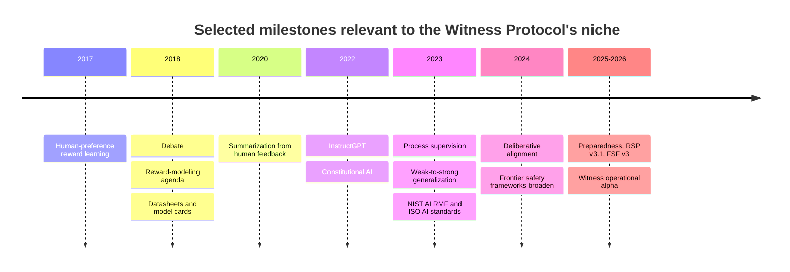

# Witness Protocol as High-Signal Alignment Data Infrastructure

## Abstract

This manuscript examines the Witness Protocol as an emergent alignment-data and governance framework rather than as a standalone alignment algorithm. Based on official Witness Protocol materials and repositories, the system is presently an operational-alpha, non-profit research infrastructure designed to build a permissioned, high-signal corpus of human testimony for AI alignment research, explicitly rejecting mass scraping in favor of selective intake, structured inquiry, governed storage, auditable synthesis, and exportable research artifacts [1]–[6]. The central claim advanced here is that the Witness Protocol’s novelty lies in turning reflective human reasoning into governed supervision objects: consent-gated testimonies, annotations, synthesized “distilled thoughts,” and provenance-bearing publication bundles. This matters because a large share of alignment progress to date has depended on higher-quality human supervision—whether in RLHF, constitutional training, process supervision, reward modeling, or weak-to-strong generalization—while frontier governance frameworks have increasingly emphasized documentation, auditability, and risk management [7]–[29]. citeturn1view1turn2view2turn4view0turn5view0turn8view0turn8view1turn10view1turn12search4turn12search1turn12search2turn12search3turn13search0turn13search1turn25search0turn24view0turn23view0turn14search0turn14search1turn22view0turn22view1turn22view2turn17search0turn17search1turn14search21turn16search3turn16search7

The manuscript makes four principal contributions. First, it reconstructs the Witness Protocol’s core mechanisms from primary sources, including the split-plane architecture between the TWP control plane and the G_5.2 runtime plane, witness-specific storage isolation, consent boundaries, PII de-linking, audit logs, CAP/REL/FELT assessment, and provenance receipts using RFC-3161, OpenTimestamps, and IPFS-related publication practices [1]–[6]. Second, it situates the protocol within the existing alignment landscape, arguing that Witness best complements rather than replaces RLHF, Constitutional AI, process supervision, deliberative alignment, scalable oversight, and frontier risk-governance frameworks [7]–[22], [25], [28], [29]. Third, it evaluates concrete training methods that the protocol could plausibly enable or improve, including supervised fine-tuning on testimony artifacts, direct preference optimization on witness-judged response pairs, process reward modeling from inquiry traces, retrieval-augmented deliberative alignment, constitutional/spec induction, and judge-bootstrapping for weak-to-strong oversight [7]–[15], [26], [27]. Fourth, it advances the original analytical claim that the Witness Protocol’s deepest contribution may be to make alignment data itself inspectable, revocable, and normatively traceable, thereby binding post-training practice more tightly to data governance and institutional legitimacy. citeturn2view2turn4view0turn5view0turn6view0turn8view0turn8view1turn12search4turn12search1turn12search2turn13search1turn25search0turn24view0turn24view1turn24view2turn13search2turn27search0turn17search0turn17search1

The paper’s conclusion is deliberately conditional. Available official materials support the view that the Witness Protocol is methodologically distinctive and potentially important, especially for alignment regimes that need richer human reasoning than ordinary preference labels provide. However, the same materials also characterize the project as alpha-stage, cohort-based, and focused on proving a controlled pipeline rather than on reporting benchmarked efficacy. For that reason, the manuscript treats training benefits as evidence-grounded hypotheses rather than established empirical results. On that basis, the Witness Protocol should be understood as a promising alignment substrate whose scientific value will depend on future publication of corpus characteristics, inter-rater reliability, ablations, training studies, and downstream evaluation results [1]–[6]. citeturn1view1turn2view2turn4view0turn5view0turn6view0turn9view0turn10view1

## Introduction

The modern alignment literature repeatedly returns to one uncomfortable fact: model behavior is often limited as much by the quality of supervision as by model architecture. InstructGPT showed that fine-tuning and RLHF can align models more closely with user intent than larger base models [7]. Preference-learning work demonstrated that complex objectives can be learned from pairwise human judgments [10], while reward-modeling agendas framed alignment as the problem of learning scalable supervisory signals rather than hand-coding utility functions [12]. Later work on summarization from human feedback, Constitutional AI, process supervision, direct preference optimization, weak-to-strong generalization, and deliberative alignment all pushed in related directions: better labels, better oversight structure, or better use of explicit normative specifications [8], [9], [13], [14], [26], [27]. citeturn12search4turn12search3turn13search1turn13search2turn12search1turn12search2turn25search0turn24view0turn27search0

At the same time, major public safety frameworks from NIST, ISO, OpenAI, Anthropic, Google DeepMind, Partnership on AI, METR, and the UK AI Security Institute increasingly stress that trustworthy AI requires more than loss functions. It also requires governance processes, documentation, evaluation discipline, and institutional controls over development and deployment [17]–[25], [28], [29]. NIST’s AI RMF organizes risk management around governance, mapping, measurement, and management [20]. ISO/IEC 42001 and ISO/IEC 23894 formalize AI management-system and AI-risk-management expectations [21], [22]. OpenAI’s Preparedness Framework, Anthropic’s Responsible Scaling Policy, and DeepMind’s Frontier Safety Framework each focus on capability thresholds, threat models, and safeguards for severe harm [17]–[19]. Yet these frameworks say much less about the upstream problem of how to build genuinely high-signal, consented, auditable alignment data. citeturn23view0turn14search0turn14search1turn22view0turn22view1turn22view2turn14search21turn16search3turn16search7

The Witness Protocol enters precisely at that gap. Its official materials define the project as an attempt to create a smaller, permissioned, and more deliberative corpus of human testimony for alignment research—one that preserves not only what people say, but how they reason, where tensions arise, and how consent and provenance are maintained throughout the pipeline [1]–[6]. The present article therefore advances a specific thesis: the Witness Protocol is best analyzed as a missing infrastructure layer between raw human data and downstream alignment methods. It is not merely a dataset proposal, nor merely a governance shell, nor merely an interview technique. It is a compound protocol for supervised human signal acquisition under explicit institutional constraints. citeturn1view1turn2view2turn4view0turn5view0turn6view0turn8view0turn8view1

Accordingly, the goal of this manuscript is not to claim that Witness has already solved alignment. The official project materials themselves explicitly disclaim such a conclusion and emphasize an alpha-stage effort to prove a controlled end-to-end method [1]–[4]. Instead, the aim is to provide a rigorous, publication-ready analysis of what the protocol is, how it relates to established alignment science and current initiatives, what concrete training methods it could enable, and where its central strengths and limitations lie. citeturn1view1turn4view0turn5view0turn7view2

## Background

The Witness Protocol Foundation describes its work as building “a permissioned, high-signal corpus of human testimony for AI alignment research,” contrasting this with mass collection and scraped opinion. The public-facing description emphasizes selective intake, structured inquiry, annotation and synthesis, governed artifacts, and eventual downstream use for evaluation, qualitative benchmarking, stress-testing, synthesis research, and future fine-tuning experiments where provenance and reasoning quality matter more than scale [1]. GitHub documentation for the TWP platform further describes the live system as an “operational alpha,” already implementing the Gate, the Inquisitor dialogue engine, an admin portal, strict PII de-identification, and support infrastructure, while listing the Constitutional Mirror and Icarus Synthesis Engine as still in development [3]. citeturn1view1turn4view0

The runtime substrate behind this protocol is G_5.2, which official project materials describe as a “shared runtime and governance kernel” supporting two product tracks: the mission-level Witness consumer and a separate educational public-facing track. Its documentation repeatedly emphasizes product isolation, dedicated policy roots, product-aware routing, portable provider abstraction, selective durable memory, and operator-facing editorial and reflection workflows [2], [4], [6]. This matters because the Witness Protocol is not presented as a loose collection workflow; it is presented as a governed runtime where what counts as truth, memory, policy, and publication is explicitly controlled. In the official authority order, live code and current architectural documents outrank archival lore, a design choice that signals unusually strong concern with drift and informal reinterpretation [2], [4], [6]. citeturn2view2turn5view0turn6view0turn8view0turn8view1

At the mechanism level, the official sources describe five especially important features. First, intake is selective: not every submission enters the process, and accepted participants become part of a managed witness cohort [1]. Second, inquiry is structured rather than conversationally open-ended: the Witness Inquisitor uses a 70/30 inquiry ratio, steel-manning, recursive “5-Whys” probing, and a synthesis policy intended to preserve distinctions between what was said, what was implied, and what is inferred [2], [5]. Third, the protocol includes explicit governance over memory and canon: inquiry sessions do not automatically rewrite the governing canon, memory is selective and inspectable rather than transcript-like, and promotion to lasting canon must pass through editorial workflow [4], [6]. Fourth, it embeds privacy and consent boundaries through de-identification, identity-vault separation, prohibition on sending raw PII to Claude-facing analysis flows, and deletion cascades on consent revocation [2], [5]. Fifth, it treats provenance as first-class, using audit logs and a published stewardship narrative that references timestamping and attestational mechanisms [2], [5]. citeturn1view1turn2view2turn5view0turn8view0turn10view1

```mermaid
flowchart LR
    subgraph CP["TWP control plane"]
        A["Selective intake"]
        B["AI sieve / qualitative triage"]
        C["Human review"]
        D["witnessId + consent state"]
    end

    subgraph RP["G_5.2 runtime and artifact plane"]
        E["Structured inquiry via Inquisitor"]
        F["De-identification and governed storage"]
        G["CAP/REL/FELT annotation"]
        H["Distilled thoughts and synthesis"]
        I["Publication bundles and provenance receipts"]
    end

    J["Downstream alignment artifacts
    eval cases · benchmarks · fine-tuning sets · stress tests"]

    A --> B --> C --> D --> E --> F --> G --> H --> I --> J
```

Figure 1 reconstructs the operational path described across the official Witness and G_5.2 materials: selective intake, consent-gated witness identification, inquiry, controlled persistence, annotation, synthesis, and export into reviewable downstream artifacts. The split between control-plane functions and runtime/artifact functions, along with the bridge anchored by `witnessId`, is explicitly described in the project’s architecture materials. citeturn1view1turn2view2turn4view0turn5view0turn6view0

A final background point is essential for scientific framing. The official materials consistently treat the current project as small by design. The public site says the immediate goal is not scale but a “small, controlled, auditable flow” that can be honestly evaluated, and the G_5.2 architecture page identifies an alpha-week target of a cohort of roughly 5–15 peers generating a 200-page exemplar dialogue corpus [1], [2]. The Witness Protocol therefore should not yet be read as a validated training corpus or benchmark suite. It is better understood, at present, as an implemented research instrument for producing potentially useful alignment artifacts under stronger constraints than are typical in present post-training pipelines. citeturn1view1turn2view2

## Methods

This manuscript uses comparative documentary analysis. The source set was restricted to English-language primary or official materials wherever possible: official Witness Protocol web properties and GitHub repositories; primary arXiv or official research pages for RLHF, Constitutional AI, process supervision, debate, reward modeling, weak-to-strong generalization, and deliberative alignment; and official governance or evaluation documents from NIST, ISO, OpenAI, Anthropic, Google DeepMind, Partnership on AI, METR, and the UK AI Security Institute [1]–[29]. The analytic task was interpretive rather than empirical: to infer the scientific role of the Witness Protocol from its publicly documented architecture and then map that role onto established alignment literatures and current initiatives. citeturn1view1turn2view2turn4view0turn5view0turn12search4turn12search1turn12search2turn13search0turn13search1turn25search0turn24view0turn23view0turn22view0turn22view1turn22view2turn16search3turn16search7

The analysis was organized around four questions. What is the protocol’s actual unit of supervision? How does it differ from existing post-training and oversight methods? Which training paradigms could most plausibly make use of its artifacts? And what claims are justified versus premature given the project’s present alpha-state maturity? This structure was chosen to avoid a familiar failure mode in early-stage AI-safety discourse: treating architectural aspiration as scientific validation. Official Witness sources provide enough information to analyze design intent and possible alignment leverage, but not enough to claim measured downstream performance. citeturn1view1turn2view2turn4view0turn5view0

The manuscript therefore makes several explicit assumptions, each grounded in the published state of the project rather than in unpublished details.

| Aspect | Assumption used in this manuscript | Basis in source record |
|---|---|---|
| Corpus scale | The current Witness corpus is treated as small, curated, and cohort-based rather than large-scale. | Official materials emphasize a controlled alpha flow, a 5–15 person cohort, and a 200-page exemplar corpus [1]–[4]. |
| Empirical status | Claims about training efficacy are treated as hypotheses, not established findings. | Official materials describe operational alpha and implemented workflows, but do not report benchmarked downstream model results [1]–[4]. |
| Annotation schema | CAP/REL/FELT is treated as publicly named but only partially specified for ML purposes; several operationalizations below are design extrapolations. | Public sources define the taxonomy and κ target, but do not publish a full academic annotation manual [2], [5]. |
| Governance constraints | Consent, de-identification, separation of identity and testimony, audit logging, and provenance are treated as mandatory design constraints for any downstream use. | These appear as explicit constitutional or invariant requirements in project documentation [2], [5], [6]. |
| Authority order | Live architecture documents and current repo docs are treated as most authoritative. | G_5.2 explicitly prioritizes live code and current system maps over archival or speculative narrative [2], [4], [6]. |

Table 1 summarizes the interpretive assumptions under which the manuscript proceeds. These assumptions are deliberately conservative because the project’s own documentation is conservative about maturity claims. citeturn1view1turn2view2turn5view0turn7view2turn10view1turn8view0turn8view1

## Analysis

The central analytic claim of this paper is that the Witness Protocol’s scientific object is neither a raw dataset nor a final policy document, but a governed testimony artifact. That is a materially different unit of alignment supervision from the units dominant in earlier paradigms: RLHF typically operates on output preferences [7], [10]; Constitutional AI operates on principled revisions and AI-generated preference signals under a written constitution [8], [16]; process supervision operates on intermediate reasoning steps [9]; deliberative alignment operates on explicit safety specifications and the model’s ability to reason over them [14], [15]. Witness, by contrast, attempts to preserve a broader bundle: selective contributor admission, contextualized inquiry, inferential structure, internal tension, annotation, synthesis, consent state, and provenance. In effect, it tries to turn human reflective judgment into a first-class research artifact rather than into a disposable labeling side-effect. citeturn1view1turn2view2turn5view0turn12search4turn12search3turn12search1turn24view2turn12search2turn24view0turn24view1

**Placement in the alignment landscape.** Existing alignment methods and governance frameworks can be sorted into at least three layers: post-training methods that convert human or AI judgments into optimization signals; oversight methods that try to preserve reliability as tasks outstrip direct human evaluation; and governance frameworks that regulate risk management, deployment, documentation, and external review [7]–[22], [25], [28], [29]. The Witness Protocol fits awkwardly if forced into only one of these bins. It behaves most plausibly as a bridge layer: upstream of post-training methods because it creates rich supervision artifacts, but downstream of governance because it operationalizes consent, provenance, and auditability within the data-generation process itself. citeturn12search4turn12search1turn12search2turn13search0turn13search1turn25search0turn24view0turn23view0turn22view0turn22view1turn22view2turn14search21turn16search3turn16search7

| Paradigm or framework | Primary problem addressed | Typical supervision unit | Human role | Relationship to Witness |
|---|---|---|---|---|
| Witness Protocol [1]–[6] | Capture reflective human judgment under consent, privacy, and provenance constraints | Testimony artifact: dialogue + annotation + synthesis + governance state | Witnesses, reviewers, operators | Focal system |
| RLHF / InstructGPT [7], [10], [26] | Align outputs to human preferences and user intent | Comparisons, rankings, demonstrations | Raters compare outputs or supply examples | Witness can improve label richness and provenance |
| Constitutional AI [8], [16] | Scale harmlessness and normative behavior using written principles and AI feedback | Constitutional rules, revisions, AI preference labels | Humans author and revise constitutions | Witness can ground constitutions in elicited cases and trade-offs |
| Process supervision [9] | Reward correct reasoning processes, not just final answers | Step-level reasoning labels | Humans evaluate intermediate steps | Witness can provide richer inquiry traces and tension labels |
| Debate / reward modeling / scalable oversight [11]–[13] | Supervise cases harder than direct human judgment | Arguments, critiques, learned reward signals | Humans judge or weaker overseers assist | Witness can supply judge-training cases and coherence criteria |
| Deliberative alignment / behavior specs [14], [15] | Teach models to reason over explicit safety specifications | Safety specifications plus synthetic reasoning data | Humans write interpretable safety policies | Witness can supply grounded cases and spec refinements |
| Frontier governance, evaluation, and documentation [17]–[25], [28], [29] | Manage severe risk, evaluation discipline, deployment safeguards, and reporting | Thresholds, reports, governance protocols, external evaluations | Organizations, standards bodies, evaluators | Witness complements by improving upstream data lineage and auditability |

Table 2 compares the Witness Protocol with adjacent alignment and governance approaches. The key conclusion is complementarity: Witness does not supersede established methods, but it could change the quality and inspectability of the human signal those methods consume. citeturn1view1turn2view2turn12search4turn12search3turn13search2turn12search1turn24view2turn12search2turn13search0turn13search1turn25search0turn24view0turn24view1turn22view0turn22view1turn22view2turn23view0turn14search0turn14search1turn14search21turn16search3turn16search7

Figure 2 places the Witness Protocol in historical sequence. The timeline suggests that Witness appears after two converging developments: first, the move from coarse supervision to richer process- and specification-based alignment; second, the move from informal safety practices to explicit governance, documentation, and external evaluation regimes. citeturn12search3turn13search0turn13search1turn17search0turn17search1turn13search2turn12search4turn12search1turn12search2turn25search0turn23view0turn14search0turn14search1turn24view0turn22view0turn22view1turn22view2turn1view1turn2view2

**Explicit correspondences to established alignment research.** Several Witness components have unusually direct analogues in the literature. The 70/30 inquiry ratio, 5-Whys forcing function, and steel-manning are not identical to process supervision, but they generate the kind of intermediate reasoning evidence that process-supervised or debate-style methods need [2], [5], [9], [11]. The Constitutional Mirror resembles a consistency-checking and self-contradiction-detection mechanism, which aligns naturally with oversight aims in debate, reward modeling, and weak-to-strong settings [2], [11]–[13]. The synthesis rule that preserves “said,” “implied,” and “inferred” distinctions echoes the documentation and transparency rationale of datasheets, model cards, and ABOUT ML-style process artifacts [2], [23]–[25]. And the protocol’s insistence that inquiry outputs do not silently become canon parallels a core concern in alignment research: avoiding uncontrolled value drift from recent, persuasive, or noisy data [6], [14], [15]. citeturn2view2turn10view1turn12search2turn13search0turn13search1turn25search0turn17search0turn17search1turn17search11turn8view0turn24view0turn24view1

| Witness component | Closest established research thread | Mechanism-level correspondence | Plausible research use |
|---|---|---|---|
| Selective intake and governed contributor admission | Dataset curation and datasheets [23], [25] | Improves signal-to-noise and records intended-use constraints | Compare curated testimony vs. open-web data for alignment tasks |
| 70/30 inquiry, steel-manning, 5-Whys | Process supervision and debate [9], [11] | Produces intermediate reasoning traces and clarification cycles | Train process reward models or critique models |
| Constitutional Mirror | Scalable oversight and coherence checking [11]–[13], [15] | Detects contradictions across sessions or artifacts | Build consistency-evaluation datasets and regularizers |
| CAP/REL/FELT taxonomy | Multi-objective reward modeling [10], [12] | Decomposes quality across multiple axes rather than one scalar | Train multi-head reward models or Pareto evaluators |
| Distilled thoughts and synthesis policy | Summarization from feedback and documentation [2], [26], [23], [24] | Converts long dialogue into inspectable summaries with inferential boundaries | Fine-tune summarizers or deliberative assistants |
| Consent, de-linking, audit logs, provenance | Model cards, governance frameworks, deployment documentation [20]–[25] | Makes source legitimacy and artifact traceability explicit | Study auditable post-training and dataset-rights governance |

Table 3 shows that the strongest correspondences arise not with one famous method, but with a cluster of methods concerned with transparency of supervision, decomposition of judgment, and auditable governance. citeturn2view2turn12search2turn13search0turn25search0turn24view1turn12search3turn13search1turn13search2turn17search0turn17search1turn23view0turn14search0turn14search1turn14search21

**Potential to enable new or improved model training methods.** Because Witness is alpha-stage, the scientifically defensible question is not “What does it empirically improve today?” but “Which known alignment methods become more plausible or potentially stronger if fed Witness-style artifacts?” The answer is substantial. The official Witness design already produces structured dialogue, explicit synthesis, contradiction checks, cohort filtering, and provenance-aware publication outputs [1]–[6]. Those are precisely the ingredients that many alignment methods currently approximate using flatter labels or synthetic substitutes [7]–[15], [26], [27]. citeturn1view1turn2view2turn4view0turn5view0turn12search4turn12search1turn12search2turn13search0turn13search1turn25search0turn24view0turn13search2turn27search0

| Training method | Concrete Witness-based example | Advantages | Risks and limitations | Implementation notes |
|---|---|---|---|---|
| Witness-supervised fine-tuning | Fine-tune a model on accepted testimony plus “distilled thoughts” that preserve explicit tension and inference boundaries | Richer than generic instruction tuning; may improve calibrated reasoning under moral uncertainty | Small corpus size; cohort bias; risk of overfitting stylistic features | Use testimony/artifact pairs; keep inferred content separable from direct quotations [1], [2], [7], [26] |
| Preference optimization using witness judgments | Generate paired model answers to ethically ambiguous prompts; witnesses or reviewers select better answers under CAP/REL/FELT criteria; optimize with DPO | Stable offline optimization and direct use of curated preference pairs | Preference labels may still collapse plural values; label cost is high | DPO is attractive because it avoids full RLHF complexity [27]; Witness could provide stronger pairs than ad hoc crowd labels [1], [2] |
| Process reward modeling | Convert inquiry turns, clarifications, and contradiction flags into step-level labels for a PRM that scores reasoning quality | Natural fit with process supervision; could reward restraint, coherence, and tension preservation | Public schema is not yet fully specified; annotation ambiguity may remain | Segment inquiry traces into trainable steps modeled after PRM-style datasets [2], [5], [9] |
| Constitutional/spec induction | Derive candidate safety principles from recurring witness-aligned cases, then subject them to human editorial review before using them in CAI or Model-Spec-style training | Bridges empirical testimony and explicit normative rules | Risks canonizing a narrow contributor distribution | Should preserve the project’s editorial gate; testimony should inform, not auto-promote, constitutions [6], [8], [15], [16] |
| Retrieval-augmented deliberative alignment | At training or inference time, retrieve witness publication bundles as case law for reasoning over difficult prompts | Improves transparency and lets the model cite grounded exemplars | Retrieval quality governs behavior; corpus incompleteness may mislead | Especially compatible with deliberative alignment, which already trains models to reason over written specifications [14], [15] |
| Judge bootstrapping and weak-to-strong oversight | Train smaller evaluators on Witness artifacts to judge stronger-model responses for coherence, uncertainty handling, and non-flattening of trade-offs | May improve scalable oversight where direct human review is scarce | Judge drift, Goodharting, and supervision bottlenecks remain | Can combine witness labels with weak-to-strong confidence techniques and external evals [11]–[13], [28], [29] |

Table 4 identifies concrete training methods that Witness could plausibly enable or strengthen. The most compelling near-term opportunities are those that require richer supervision rather than larger scale: process reward models, deliberate summarization, and curated preference optimization. citeturn1view1turn2view2turn12search4turn13search2turn27search0turn12search2turn12search1turn24view1turn24view2turn24view0turn13search0turn13search1turn25search0turn16search3turn16search7

A concrete example clarifies the point. Suppose a base model is asked to answer a morally charged prompt involving conflict between honesty, care, uncertainty, and legal risk. Ordinary RLHF often reduces such cases to a single chosen response. Under a Witness-style pipeline, the same case could yield a much denser training artifact: the witness’s own reasoning; the Inquisitor’s clarifying questions; explicit tensions; a synthesis distinguishing statement from inference; CAP/REL/FELT judgments; and provenance metadata. That single case can then support at least four distinct learning objectives: supervised copying of reflective structure, pairwise preference learning, process reward estimation, and retrieval-based deliberation over prior cases. This is not a proven production method; it is, however, a well-grounded design hypothesis implied by the combination of Witness’s artifact structure and the training mechanisms established in prior alignment literature [1], [2], [7]–[10], [14], [26], [27]. citeturn1view1turn2view2turn12search4turn12search1turn12search2turn12search3turn24view0turn13search2turn27search0

**Original insights.** The first original insight of this analysis is that the Witness Protocol reframes alignment data from “label” to “testimony object.” That is a meaningful conceptual shift. A label is usually treated as consumed once optimization finishes. A testimony object remains inspectable as an epistemic and governance artifact: one can ask who contributed it, under what consent state, using what inquiry protocol, with what editorial transformations, and with what provenance receipts. The protocol thus brings alignment data closer to the documentation ideals articulated in datasheets, model cards, and deployment-governance frameworks, but makes those ideals upstream-generative rather than merely retrospective reporting tools [2], [20]–[25]. citeturn2view2turn23view0turn14search0turn14search1turn17search0turn17search1turn14search21

The second original insight is that Witness suggests a route toward multi-objective alignment that does not immediately collapse human judgment into a single reward scalar. CAP/REL/FELT publicly names at least three distinct evaluative axes—capability-oriented, relational, and somatic cues—while the synthesis policy requires preservation of internal tension rather than premature coherence [2]. If these dimensions were operationalized into separate reward heads or preference criteria, Witness-derived supervision could support Pareto-style post-training or explicit trade-off reasoning, which would be more faithful to many real human judgments than monolithic helpfulness-harmlessness scores. This remains an extrapolation, but it is an extrapolation better grounded than many current post-training pipelines because the project already names a multidimensional evaluative ontology. citeturn2view2turn10view1

The third original insight is that Witness may be especially useful for what might be called deliberative humility. The protocol explicitly values reasoning under uncertainty, ethical self-location, relational awareness, reflective restraint, contradiction surfacing, and preserved tensions [1], [2]. These are not just moral niceties. They are properties associated with avoiding brittle overconfidence, sloganizing, and shallow refusal heuristics—failure modes that both post-training and model-behavior-documentation efforts continue to confront [1], [14]–[16]. In this sense, Witness could help train systems that do not merely follow rules, but can show why multiple considerations remain live at once. citeturn1view1turn2view2turn24view0turn24view1turn24view2

The fourth original insight is institutional rather than algorithmic. The Witness Protocol treats consent revocation, identity/testimony separation, auditability, and publication provenance as alignment-relevant features rather than as external compliance burdens [2], [5], [6]. That is important because current frontier frameworks tend to focus on model capabilities, deployment thresholds, or external evaluations [17]–[19], [28], [29]. Witness instead suggests that who may legitimately supervise a model, under what conditions, and with what revocability may itself be part of the alignment problem. That idea deserves more attention than it has received in mainstream technical publications. citeturn2view2turn10view1turn8view0turn8view1turn22view0turn22view1turn22view2turn16search3turn16search7

## Discussion

The Witness Protocol has three major strengths as an alignment proposal. The first is signal quality. Its designers explicitly reject data quantity as the main objective and instead target reflective, structured, auditable human reasoning [1]. That aligns well with a growing body of alignment work showing that better supervision structure can dominate crude scale increases in post-training [7]–[10], [14], [26], [27]. The second is governance integration: unlike most alignment datasets, Witness was designed from the outset around consent, de-identification, audit logging, and explicit publication artifacts [2], [5], [6]. The third is interoperability with current alignment directions: the protocol can in principle feed SFT, DPO, process reward models, constitutional/spec refinement, and oversight-evaluation pipelines without having to replace them. citeturn1view1turn12search4turn12search3turn12search2turn24view0turn13search2turn27search0turn2view2turn10view1turn8view0turn8view1

Its limitations are equally serious. Selective intake can protect quality, but it also introduces selection effects, potentially overrepresenting articulate, reflective, unusually motivated, or culturally local contributors. A small initial cohort may be scientifically useful for pipeline validation yet normatively narrow as a source of general human values [1], [2]. The protocol also risks privileging sincerity and narrative coherence over correctness: a witness can be reflective and still wrong. In addition, preserving rich inferential distinctions is annotation-intensive, and public materials do not yet provide the level of dataset-card detail that a peer-reviewed release would ordinarily require, even though the project’s design philosophy is broadly aligned with that goal [2], [20]–[25]. citeturn1view1turn2view2turn23view0turn14search0turn14search1turn17search0turn17search1turn14search21

There is also a deeper alignment-theoretic worry. Witness is strongest where the target behavior depends on nuanced human judgment, but that same strength may become fragility when value pluralism is sharp. Anthropic’s constitutional materials explicitly discuss the difficulty of balancing safety, ethics, company guidelines, and helpfulness [16]. OpenAI’s Model Spec similarly frames model behavior as a chain-of-command problem with sometimes competing values [15]. Witness offers richer empirical cases for such trade-offs, but richer cases do not by themselves resolve normative disagreement. The protocol may therefore be best suited not to discovering a single “true” human value function, but to building better training and evaluation artifacts for reasoning under contested values. That is a more modest claim, but also a more credible one. citeturn24view2turn24view1

From the standpoint of peer review, the Witness Protocol today is strongest as a design-science contribution. The public evidence supports claims about architecture, governance, and plausible scientific use, but not claims about downstream efficacy. The project’s own materials describe an alpha system proving an end-to-end method rather than publishing benchmark tables [1]–[4]. For the Witness Protocol to move from promising concept to established alignment contribution, future empirical publications would need at minimum to report corpus composition, contributor and sampling procedures, annotation rules, inter-rater reliability outcomes, ablations on inquiry structure, and quantitative effects on downstream training or evaluation tasks. Until such work appears, rigorous analysis should neither dismiss Witness as mere rhetoric nor inflate it into solved science. It is, more soberly, a serious research instrument whose scientific case remains open. citeturn1view1turn2view2turn4view0turn5view0

## Conclusion

The Witness Protocol deserves attention because it occupies an underdeveloped but increasingly important part of the alignment stack: the generation of high-signal, consented, auditable human supervision artifacts. Official materials show a system already structured around selective intake, adversarially clarifying inquiry, governed synthesis, storage isolation, revocable consent, and provenance-aware publication outputs [1]–[6]. The broader alignment literature suggests that such artifacts could be valuable across multiple methods, especially where existing pipelines depend on shallow preference labels or weakly documented supervision [7]–[15], [26], [27]. citeturn1view1turn2view2turn4view0turn5view0turn12search4turn12search1turn12search2turn13search0turn13search1turn25search0turn24view0turn13search2turn27search0

The most defensible conclusion is therefore twofold. Scientifically, the Witness Protocol is best interpreted as alignment-data infrastructure and a supervised-governance protocol, not yet as a validated training breakthrough. Strategically, however, it may point toward an important next phase of alignment research: one in which the quality, legitimacy, and inspectability of human supervision are treated as central technical variables rather than administrative afterthoughts. If that shift proves empirically fruitful, Witness will matter not because it replaced RLHF, Constitutional AI, process supervision, or frontier-safety frameworks, but because it gave those methods better human material to learn from and better artifacts through which to be audited [1]–[29]. citeturn1view1turn2view2turn12search4turn12search1turn12search2turn13search0turn13search1turn25search0turn24view0turn23view0turn22view0turn22view1turn22view2turn16search3turn16search7

## References

[1] The Witness Protocol Foundation, *A Better Dataset for AI Alignment*. Official project overview, 2026.

[2] The Witness Protocol Foundation, *G_5.2: The Governed Inquiry Runtime and Governance Kernel*. Official architecture overview, 2026.

[3] TWPfoundation, *TWP Repository README*. GitHub repository documentation, 2026.

[4] TWPfoundation, *G_5.2 Repository README*. GitHub repository documentation, 2026.

[5] TWPfoundation, *AGENTS.md — The Witness Protocol Foundation Platform*. Project engineering and governance constraints, 2026.

[6] TWPfoundation, *G_5.2 system-map.md; invariants.md; LINEAGE_AND_BOUNDARIES.md*. Authoritative subsystem, invariant, and boundary documentation, 2026.

[7] Ouyang, L., Wu, J., Jiang, X., et al. *Training Language Models to Follow Instructions with Human Feedback*. arXiv:2203.02155, 2022.

[8] Bai, Y., Kadavath, S., Kundu, S., et al. *Constitutional AI: Harmlessness from AI Feedback*. arXiv:2212.08073, 2022.

[9] Lightman, H., Kosaraju, V., Burda, Y., et al. *Let’s Verify Step by Step*. arXiv:2305.20050, 2023.

[10] Christiano, P., Leike, J., Brown, T. B., et al. *Deep Reinforcement Learning from Human Preferences*. arXiv:1706.03741, 2017.

[11] Irving, G., Christiano, P., and Amodei, D. *AI Safety via Debate*. arXiv:1805.00899, 2018.

[12] Leike, J., Krueger, D., Everitt, T., et al. *Scalable Agent Alignment via Reward Modeling: A Research Direction*. arXiv:1811.07871, 2018.

[13] Burns, C., Izmailov, P., Kirchner, J. H., et al. *Eliciting Strong Capabilities with Weak Supervision*. arXiv:2312.09390, 2023.

[14] Guan, M. Y., Zhou, H., Ippolito, D., et al. *Deliberative Alignment: Reasoning Enables Safer Language Models*. arXiv:2412.16339, 2024.

[15] OpenAI, *Model Spec* and *Our Approach to the Model Spec*. Official model-behavior framework materials, 2025–2026.

[16] Anthropic, *Claude’s Constitution*. Official constitutional guidance for Claude models, 2026.

[17] OpenAI, *Preparedness Framework, Version 2*. Official frontier-risk framework, 2025.

[18] Anthropic, *Responsible Scaling Policy, Version 3.1*. Official catastrophic-risk governance framework, 2026.

[19] Google DeepMind, *Frontier Safety Framework* and *Gemini 3 Pro Frontier Safety Framework Report*. Official severe-risk framework materials, 2024–2025.

[20] National Institute of Standards and Technology, *Artificial Intelligence Risk Management Framework (AI RMF 1.0)*, NIST AI 100-1, 2023.

[21] ISO/IEC, *ISO/IEC 42001:2023 — Artificial Intelligence Management Systems*, 2023.

[22] ISO/IEC, *ISO/IEC 23894:2023 — Artificial Intelligence: Guidance on Risk Management*, 2023.

[23] Gebru, T., Morgenstern, J., Vecchione, B., et al. *Datasheets for Datasets*. arXiv:1803.09010, 2018.

[24] Mitchell, M., Wu, S., Zaldivar, A., et al. *Model Cards for Model Reporting*. arXiv:1810.03993, 2018.

[25] Partnership on AI, *Guidance for Safe Foundation Model Deployment*. Official framework for model deployment governance, 2023.

[26] Stiennon, N., Ouyang, L., Wu, J., et al. *Learning to Summarize from Human Feedback*. arXiv:2009.01325, 2020.

[27] Rafailov, R., Sharma, A., Mitchell, E., et al. *Direct Preference Optimization: Your Language Model Is Secretly a Reward Model*. arXiv:2305.18290, 2023.

[28] METR, *About* and *Risk Assessment*. Official evaluation-organization materials, 2026.

[29] UK AI Security Institute, *About* and official evaluation publications. Government evaluation and mitigation materials, 2024–2026.